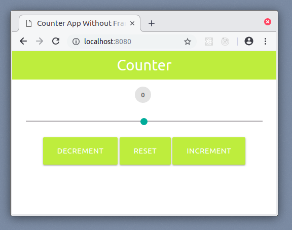

# PM102 Examples

This repo contains the code examples for the PM102 class held in winter semseter
2018 at FH Kiel.

Each example can be found in a separate subfolder.

### Requirements

You will need to install the following tools:

* **Node.js** JavaScript runtime
* **npm** package manager
* **npx** package runner

### Running Examples:

From an example folder run

```bash
npm start
```

to run an example.

**NOTE:** windows users have to run this command in a BASH shell. Use Git BASH for example.

### List of examples:

#### Counter

`/counter`
[view app](https://pm102-counter.appspot.com/)

A very basic app, demonstrates the use of events and handlers


